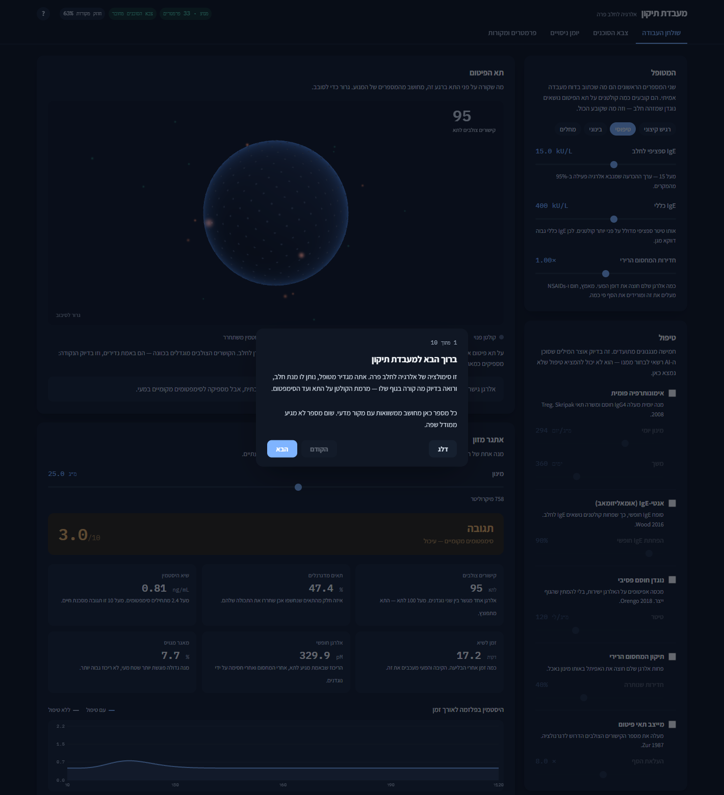

# Tikkun Lab · מעבדת תיקון

**A simulation of cow's-milk allergy where AI agents propose treatments and a deterministic engine computes what actually happens.**

*[English](#english) · [עברית](#עברית)*



[](LICENSE)
[](#running-the-tests)
[](validate.py)

**[▶ Try the interactive lab](https://claude.ai/code/artifact/98d0e5cf-a900-47fe-bc72-75f7d1735c66)** · **[Background research](https://claude.ai/code/artifact/5c676b01-a986-4790-a8ba-bee10eb71188)**

---

## English

### The one rule

**No language model produces a number in this project.**

That is not a line in a prompt — it is enforced structurally:

| Layer | Who produces it | How it is enforced |
|---|---|---|
| Interventions | AI agent | [`agents/protocol.py`](agents/protocol.py) — a closed vocabulary. Anything outside it is rejected with `InterventionError` |
| Numbers | The engine | [`engine/`](engine/) — binding equilibria and ODEs. Deterministic, bit-identical between runs |
| Interpretation | AI agent | [`agents/guard.py`](agents/guard.py) — every figure in an agent's prose is flagged unless it traces back to engine output |
| Dose search | The engine | [`agents/optimise.py`](agents/optimise.py) — choosing *which* mechanisms to combine is judgement; choosing the doses is search |

An agent cannot return "histamine fell to 3 ng/mL". It can only return
`anti_ige(free_ige_reduction=0.9)`, and the engine computes what that does.

### Who this is for

- **Immunology and pharmacology teaching.** The mechanism is visible end to end: receptor crosslinking, mast cell degranulation, histamine, symptom score. Every parameter carries a citation.
- **People building LLM-agent systems for science.** The interesting part is not the biology — it is the enforced separation between a model's judgement and a simulator's arithmetic, and a guard that catches fabricated numbers. That pattern transfers to any domain.
- **Anyone curious about food allergy.** Open the lab, drag the dose slider, and watch why a trace of milk can floor one child while another drinks a glass.

**Who this is not for:** anyone making a decision about a real person's care. This is not a medical device and has never been clinically validated — read [DISCLAIMER.md](DISCLAIMER.md) before you do anything else with it.

### Run it

```bash
git clone https://github.com/liortesta/tikkun-lab.git
cd tikkun-lab
pip install -r requirements.txt
python app.py            # opens at http://127.0.0.1:8756
```

Only numpy and scipy are needed — the server is standard library.
Four screens: **bench** (live simulation and a 3D mast cell), **agent army**, **experiment log**, **parameters and sources**. A guided tour opens on first launch; the **?** button replays it.

Without a browser:

```bash
python validate.py           # 14 checks against published literature
python cli.py threshold      # each patient's reaction threshold
python cli.py lab --offline  # the agent loop, no API key needed
node web/build.mjs           # build the standalone page
```

### What makes the numbers trustworthy

Four parameters are fitted to published clinical anchors. Everything else is measured or an explicit modelling assumption, and [`cli.py audit`](cli.py) prints the provenance of all 33.

[`validate.py`](validate.py) keeps **fitting and testing separate**:

```
ANCHORS — fitted to these, so passing only proves the fit converged
  [PASS] VITAL population ED50 for milk ~25 mg
  [PASS] severe reaction plasma histamine 10-15 ng/mL
  [PASS] 12 months milk OIT shifts eliciting dose ~100x
  [PASS] post-OIT specific IgG4 reaches ~60 mg/L

PREDICTIONS — never shown to the fit
  [PASS] VITAL ED05 reference dose = 0.2 mg  (model says 0.145 mg)
  [PASS] blocking IgG4 carries most of the protection, not Treg
  [PASS] protection is lost after OIT stops
  [PASS] crosslinking shows the prozone effect near 1/(2*k_bind)
  [PASS] severity never decreases with dose across the clinical range
  ...
14/14 passed (10/10 of them predictions the fit never saw)
```

Those ten predictions are the only evidence here worth anything. The anchors only prove the fit converged.

### The agent army

Five stages, four of which are real work rather than text:

1. **Design** — a principal investigator proposes protocols from the closed vocabulary
2. **Simulate** — the engine runs every one
3. **Review** — an immunologist, a pharmacologist and a toxicologist read the output *in parallel*
4. **Judge** — a critic ranks them and states what was not tested
5. **Optimise** — the engine grid-searches the winner's doses under a hard safety constraint: **the starting dose must sit below the patient's own eliciting dose**

That constraint came from the specialist reviews raising it every single run. In a live run the optimiser found that raising anti-IgE from 90% to 99% makes a 300 mg/day start safe *and* halves the course from 365 to 180 days — which is the real clinical rationale for giving omalizumab before milk OIT ([Wood 2016](https://doi.org/10.1016/j.jaci.2015.10.005)). The engine reached that from the constraint alone.

Bring your own key (`KIE_API_KEY` or `OPENROUTER_API_KEY`, see [`.env.example`](.env.example)). Without one, `--offline` runs a built-in protocol panel and the engine, validation and bench all work fully.

### The 3D cell

Everything drawn is bound to a computed value; nothing is drawn that the model does not know.

| On screen | Where it comes from |
|---|---|
| Faint dots | bare FcεRI receptors |
| Blue dots | receptors carrying milk-specific IgE — `sensitizedReceptors()` |
| Gold dots | an allergen has bridged two of them — `crosslinks()` |
| Green motes | β-lactoglobulin, at the free concentration |
| Orange motes | histamine leaving, at the actual degranulation rate |

One honest scaling decision: bridged receptors really are about 200 out of a quarter million — under a tenth of a percent. At true scale they vanish, so they are deliberately enlarged and the caption says so. **The rarity is the finding**, not a display bug: roughly a hundred bridges fire an entire cell.

Raw WebGL2, no library — a general-purpose 3D engine is hundreds of kilobytes to draw one sphere.

### Layout

```
app.py            the application — local server, standard library only
engine/           the engine — every number is born here
  provenance.py     unit, citation and provenance class for each parameter
  binding.py        crosslinking equilibrium, epitope blocking
  params_milk.py    the parameter registry
  milk.py           the model — fast challenge, slow immunotherapy
  metrics.py        EC50, Hill curves, therapeutic index
agents/           agents propose and interpret; they never compute
  protocol.py       the closed intervention vocabulary
  guard.py          detector for untraceable numbers
  optimise.py       dose search with the safety constraint
  lab.py            design → simulate → review → judge → optimise
  client.py         transport for KIE and OpenRouter
web/              the front end
  app.html/app.js   the application
  cell3d.js         the 3D mast cell
  tour.js           the first-run guide
  engine.js         JavaScript port of the engine
  verify.mjs        292 values compared against the Python engine
scripts/
  audit_secrets.py  pre-push credential scan
```

### Running the tests

```bash
python -m pytest tests/ -q     # 123 tests
python validate.py             # 14 literature checks
node web/verify.mjs            # 292 engine-port comparisons
node web/frontend-check.mjs    # boots the UI against a DOM shim
python scripts/audit_secrets.py
```

The browser engine is a JavaScript port, and it is not trusted: `verify.mjs`
compares 292 values against Python, `build.mjs` refuses to build if it drifted,
and pytest fails if the engine changed and the reference fixture went stale.

### What this is not

The eliciting dose here is **simulated, not measured** — a real patient may differ by an order of magnitude. The model has no mediators besides histamine, does not separate casein from whey, and does not simulate dose errors or varying co-factors. Eleven of 33 parameters were fitted rather than observed.

### Contributing

Pull requests welcome. Please keep the one rule: if a change would let a model emit a quantity, it is the wrong change — add a lever to `agents/protocol.py` with its mechanism and citation instead.

Every parameter needs a unit, a provenance class and a citation. Never fit to something `validate.py` lists as a `PREDICTION`; if you must, move it to `ANCHORS` explicitly so the prediction count drops visibly.

Run all five checks above before opening a PR.

### Credit

Built by [Lior Testa](https://github.com/liortesta). MIT licensed — fork it, build on it, ship it. If it helped, a link back is appreciated.

---

## עברית

### הכלל היחיד

**שום מודל שפה לא מייצר מספר בפרויקט הזה.**

זו לא בקשה בפרומפט — זה נאכף במבנה:

| שכבה | מי מייצר | איך זה נאכף |
|---|---|---|
| התערבויות | סוכן AI | [`agents/protocol.py`](agents/protocol.py) — אוצר מילים סגור. כל דבר מחוצה לו נדחה |
| מספרים | המנוע | [`engine/`](engine/) — שיווי משקל קישור ומערכות ODE. דטרמיניסטי, בייט־זהה בין ריצות |
| פרשנות | סוכן AI | [`agents/guard.py`](agents/guard.py) — כל מספר בטקסט של סוכן מסומן אם אינו ניתן לייחוס |
| חיפוש מינון | המנוע | [`agents/optimise.py`](agents/optimise.py) — *אילו* מנגנונים לשלב זו שיפוטיות; המינונים הם חיפוש |

סוכן לא יכול להחזיר "ההיסטמין ירד ל-3 ng/mL". הוא יכול להחזיר רק
`anti_ige(free_ige_reduction=0.9)` — והמנוע מחשב מה זה עושה.

### למי זה מתאים

- **הוראת אימונולוגיה ופרמקולוגיה.** המנגנון גלוי מקצה לקצה: קישור צולב של קולטנים, דגרנולציית תאי פיטום, היסטמין, ציון סימפטומים. לכל פרמטר יש ציטוט.
- **מי שבונה מערכות סוכני LLM למדע.** החלק המעניין הוא לא הביולוגיה — אלא ההפרדה הנאכפת בין שיפוטיות של מודל לבין אריתמטיקה של סימולטור, ושומר שתופס מספרים מומצאים. התבנית עוברת לכל תחום.
- **כל מי שסקרן לגבי אלרגיה למזון.** פתח את המעבדה, גרור את סליידר המינון, וראה למה שריד של חלב מפיל ילד אחד בזמן שאחר שותה כוס.

**למי זה לא מתאים:** לכל מי שמקבל החלטה על טיפול באדם אמיתי. זה לא מכשיר רפואי והוא מעולם לא עבר ולידציה קלינית — קרא את [DISCLAIMER.md](DISCLAIMER.md) לפני כל דבר אחר.

### הרצה

```bash
git clone https://github.com/liortesta/tikkun-lab.git
cd tikkun-lab
pip install -r requirements.txt
python app.py            # נפתח על http://127.0.0.1:8756
```

צריך רק numpy ו-scipy — השרת בנוי מהספרייה הסטנדרטית.
ארבעה מסכים: **שולחן העבודה** (סימולציה חיה ותא פיטום תלת־ממדי), **צבא הסוכנים**, **יומן ניסויים**, ו**פרמטרים ומקורות**. בכניסה הראשונה נפתחת הדרכה מודרכת; כפתור **?** מחזיר אותה.

בלי דפדפן:

```bash
python validate.py           # 14 בדיקות מול ספרות מדעית
python cli.py threshold      # סף התגובה של כל מטופל
python cli.py lab --offline  # לולאת הסוכנים, בלי מפתח API
node web/build.mjs           # בניית הדף העצמאי
```

### למה אפשר לסמוך על המספרים

ארבעה פרמטרים הותאמו לעוגנים קליניים מפורסמים. כל השאר נמדד או מסומן במפורש כהנחת מידול, ו-`python cli.py audit` מדפיס את המקור של כל 33.

[`validate.py`](validate.py) שומר על **הפרדה בין התאמה לבדיקה**: ארבעה עוגנים שהמודל הותאם אליהם, ועשר **תחזיות שההתאמה מעולם לא ראתה** — כולל ערך הייחוס ED05 של VITAL (0.2 מ״ג; המודל אומר 0.145), אפקט הפרוזון, ואובדן ההגנה אחרי הפסקת טיפול.

עשר התחזיות הן העדות היחידה שמשמעותית כאן. העוגנים רק מוכיחים שההתאמה התכנסה.

### צבא הסוכנים

חמישה שלבים, וארבעה מהם עבודה אמיתית ולא טקסט:

1. **תכנון** — חוקר ראשי מציע פרוטוקולים מאוצר המילים הסגור
2. **סימולציה** — המנוע מריץ כל אחד
3. **ביקורת** — אימונולוג, פרמקולוג וטוקסיקולוג קוראים את הפלט **במקביל**
4. **שיפוט** — מבקר מדרג ואומר מה לא נבדק
5. **כיול** — המנוע מחפש את מינוני המנצח תחת אילוץ בטיחות קשיח: **מנת הפתיחה חייבת להיות מתחת לסף של המטופל**

האילוץ הזה הגיע מכך שהמומחים העלו אותו בכל ריצה. בהרצה חיה המכייל מצא שהעלאת אנטי-IgE מ-90% ל-99% הופכת מנת פתיחה של 300 מ״ג לבטוחה **ומקצרת את הטיפול מ-365 ל-180 יום** — וזה בדיוק הרציונל הקליני של מתן אומאליזומאב לפני אימונותרפיה ([Wood 2016](https://doi.org/10.1016/j.jaci.2015.10.005)). המנוע הגיע לזה מהאילוץ לבדו.

המפתח שלך (`KIE_API_KEY` או `OPENROUTER_API_KEY`, ראה [`.env.example`](.env.example)). בלי מפתח, `--offline` מריץ פאנל מובנה — והמנוע, הולידציה ושולחן העבודה עובדים במלואם.

### התא התלת־ממדי

כל דבר שמצויר קשור למספר שהמנוע חישב, ושום דבר לא מצויר שהמודל לא יודע: נקודות דהויות הן קולטנים פנויים, כחולות נושאות IgE לחלב, זהובות הן קולטנים שאלרגן גישר ביניהם, ירוקות הן חלבון חלב, וכתומות הן היסטמין שמשתחרר.

החלטת קנה מידה אחת: קושרים צולבים הם באמת כ־200 מתוך רבע מיליון קולטנים — פחות מעשירית האחוז. בקנה מידה אמיתי הם נעלמים, ולכן הם מוגדלים בכוונה והכיתוב אומר את זה. **הנדירות היא הממצא**, לא באג: כמאה גישורים מפעילים תא שלם.

WebGL2 גולמי, בלי ספרייה.

### מה זה לא

הסף המעורר כאן **מסומלץ, לא נמדד** — מטופל אמיתי עלול להיות שונה בסדר גודל. המודל לא כולל מתווכים מלבד היסטמין, לא מפריד בין קזאין למי גבינה, ולא מדמה טעויות מינון או קו־פקטורים משתנים. 11 מתוך 33 פרמטרים הותאמו ולא נמדדו.

**אין להסיק מכאן שום החלטה קלינית.**

### להמשיך לפתח

Pull requests יתקבלו בברכה. שמור על הכלל היחיד: אם שינוי מאפשר למודל לפלוט כמות — זה השינוי הלא נכון. הוסף מנוף ל-`agents/protocol.py` עם המנגנון והציטוט שלו במקום.

לכל פרמטר צריך יחידה, סיווג מקור וציטוט. לעולם אל תתאים למשהו ש-`validate.py` מסמן כ-`PREDICTION`.

הרץ את חמש הבדיקות לפני PR:

```bash
python -m pytest tests/ -q
python validate.py
node web/verify.mjs
node web/frontend-check.mjs
python scripts/audit_secrets.py
```

### קרדיט

נבנה על ידי [Lior Testa](https://github.com/liortesta). רישיון MIT — עשה fork, בנה על זה, שחרר. אם זה עזר, קישור חזרה מוערך.
